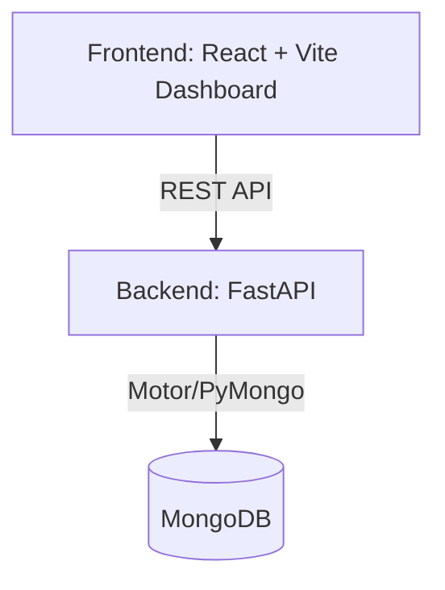
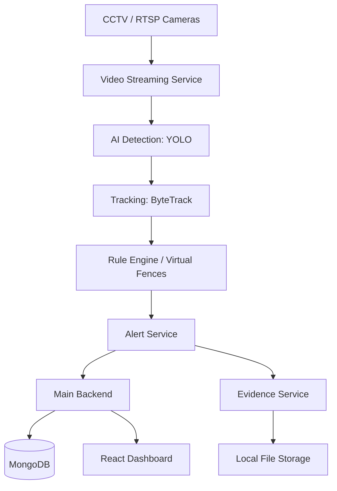

# Architecture

## Current Phase 1 Architecture
The Phase 1 architecture establishes the foundational components required for the intelligent border video analytics platform. It focuses on setting up a scalable backend, a functional frontend dashboard, and a connected database.

### Components
1. **Frontend (React)**: Provides the command-centre interface for operators. It connects to the backend via REST API.
2. **Backend (FastAPI)**: Serves as the central API gateway. It handles configuration, database connections, and placeholder routes for cameras, events, and zones.
3. **Database (MongoDB)**: Stores persistent data. Currently prepared for collections such as cameras, events, zones, and audit_logs.

## Future Architecture (Phase 2+)
In upcoming phases, AI analytics and video processing capabilities will be introduced. The architecture will expand significantly:

### Future Services
- **detector.py**: Object detection (person/vehicle).
- **tracker.py**: Multi-object tracking.
- **intrusion_service.py**: Virtual fence monitoring.
- **alert_service.py**: Real-time alert generation and notification.
- **evidence_service.py**: Captures and stores snapshots and video clips for security events.
